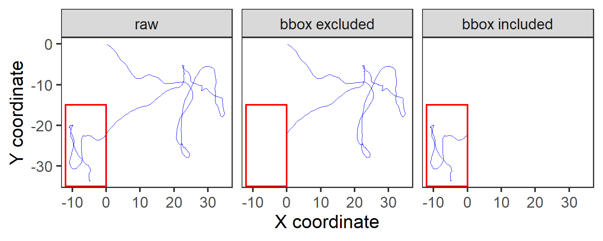

# Cleaning point data

## Filtering within spatio-temporal bounds

Here, we simulate some movement data using the `smoove` `R` package from [@gurarie2017].

```{r prep_libs_02_01}
library(data.table)
library(ggplot2)

library(atlastools)
```


```{r sim_data}
# uses smoove from Gurarie et al. (2017)
library(smoove)
nu <- 2
tau <- 5
dt <- .1 
ucvm1 <- simulateUCVM(nu=nu, tau=tau, T.max = 100, dt = dt)

# add a reflection to x_max + x_max / 10, y_max + y_max / 10
data <- as.data.table(ucvm1$XY)
data[, time := seq_len(nrow(data))]
data <- data[seq_len(1000), ]

fwrite(data, "data/sim_data_sec_02_01.csv")
```

Here we read the simulated data in, and plot it to observe its extent.

```{r read_sim_data, eval=TRUE}
# read in the data
data <- data.table::fread("data/sim_data_sec_02_01.csv")

# process the data to remove points in this range
data_excluded <- atlastools::atl_filter_bounds(data,
                                               x = "x", y = "y",
                                               x_range = c(-15, 0),
                                               y_range = c(-35, -15))
# process to keep points inside
data_included <- atlastools::atl_filter_bounds(data,
                                               x = "x", y = "y",
                                               x_range = c(-15, 0),
                                               y_range = c(-35, -15),
                                               remove_inside = FALSE)

# join the data
data[, type := "raw"]
data_excluded[, type := "bbox excluded"]
data_included[, type := "bbox included"]
data <- rbind(data, data_excluded, data_included)

# arrange type
data$type <- factor(data$type, 
                    levels = c("raw", "bbox excluded", "bbox included"))
```

```{r plot_sim_data, include=FALSE}
# plot the data
ggplot(data)+
  geom_path(aes(x, y),
            size = 0.1,
            col = "blue")+
  geom_rect(xmin = -12, xmax = 0,
            ymin = -35, ymax = -15,
            colour = "red",
            fill = NA)+
  facet_grid(~ type)+
  theme_test()+
  labs(x = "X coordinate",
       y = "Y coordinate")

# save figure
ggsave("figures/fig_filter_bbox.png", dpi = 300, width = 5, height = 2)
```



Explicit spatial filtering is a finer method which examines whether the tracking data lie within a polygon, which may be irregular. This typically involves converting the data’s position coordinates to a multi-point spatial geometry, and finding the intersection with a polygon or multi-polygon geometry representing a study area. 
Combined with knowledge of species’ biology and the study site, explicit spatial filtering can be used to remove obviously erroneous positions such as those that would place an individual in an area it is physiologically incapable of traversing. The main drawback to explicit spatial filtering is that it is computationally intensive, and it is advisable to apply a coarse bounding box filter first in order to reduce the computational load, and only then filter by an irregular spatial feature. 

Both bounding box and explicit spatial filters can be combined with the timestamp of a position to remove locations where time is an important determinant of accessibility. For example, terrestrial species may be able to access the bottom of a waterbody only during certain times of day or year, and data whose time and position coordinates do not meet these criteria can be removed. 
Temporal filtering can also be applied independently of spatial filtering to exclude positions from certain time periods during tracking. These are typically periods when data are expected to be biased, such as where an animal has been fitted with a tracker but has not been released, or from the first day after fitting a tracker to avoid including movement behaviour biased by the stress of the capture. 
When combining spatial and temporal filters, it is better to apply the temporal filter first, since it is less computationally intensive than even a bounding box filter, and much less so than an explicit spatial filter, while reducing the number of positions that must be examined by these subsequent filters. 
In any case, broad filters must always be applied with caution; they are especially susceptible to excluding data that represent novel behaviour of which researchers are unaware, such as a new movement mode or changed local conditions which make it possible for species to move across previously inaccessible regions.
