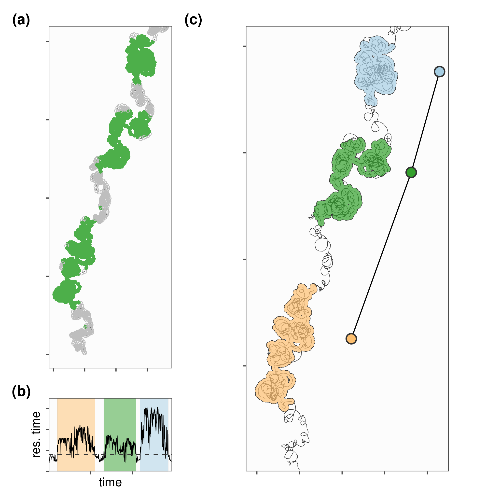

# Residence patches and their construction

## Prepare libraries {-}

```{r prep_libs_02_01}
library(data.table)
library(atlastools)
library(ggplot2)
library(patchwork)

# for residence time
library(recurse)

# prepare a palette
pal <- RColorBrewer::brewer.pal(4, "Set1")
```

## An example with simulated data

### Read data and classify

```{r}
# read patch data
data <- fread("data/data_for_res_patch.csv")

# filter
data <- data[y < 21, ]

# do recurse
data_recurse <- getRecursions(data[, list(x, y, time, id)],
                              radius = 1)

# assign residence time
data[, residence_time := data_recurse$residenceTime]
```

We first plot a figure of residence time per positions, and residence time per timestamp.

```{r}
# restime by position
fig_res_a <-
  ggplot()+
  # geom_path(data = data,
  #           aes(x, y),
  #           lwd = 0.2,
  #           col = "grey20")+
  geom_path(data = data,
             aes(x, y, 
                 group = NA,
                 col = residence_time > 0.04),
             show.legend = F,
             alpha = 1)+
  coord_equal(ylim = c(NA, 20))+
  scale_colour_manual(values = c("grey", pal[3]))+
  # scale_shape_manual(values = c(, 1))+
  ggthemes::theme_few()+
  theme(axis.text = element_blank(),
        axis.title = element_blank())
```

We construct residence patches from data where residence time is > 0.15.

```{r}
# make residence patch
patch <- atl_res_patch(data[residence_time > 0.04, ], 
                       buffer_radius = 0.1, 
                       lim_spat_indep = 1, 
                       lim_time_indep = 30)


# get spatial representation
patch_sf <- atl_patch_summary(patch_data = patch,
                              which_data = "spatial", 
                              buffer_radius = 0.15)

# get summary data
patch_summary <- atl_patch_summary(patch_data = patch,
                                   which_data = "summary")
```

### Plot classified residence patches

```{r}
# plot_patches <-
fig_res_b <-
  ggplot()+
  geom_path(data = data,
            aes(x, y),
            col = "grey20",
            lwd = 0.2)+
  scale_colour_manual(values = c("grey", pal[3]))+
  geom_sf(data = patch_sf,
          aes(fill = patch),
          colour = "grey20",
          alpha = 0.7,
          lwd = 0.2,
          show.legend = FALSE)+
  geom_path(data = patch_summary,
            aes(x_median + 3, y_median),
            col = "grey0",
            size = 0.5)+
  geom_point(data = patch_summary,
             aes(x_median + 3,
                 y_median,
                 fill = patch),
             col = "grey20",
             size = 4,
             stroke = 1,
             shape = 21,
             show.legend = F)+
  scale_fill_distiller(palette = "Paired")+
  coord_sf(ylim = c(1, 20))+
  ggthemes::theme_few()+
  theme(axis.text = element_blank(),
        axis.title = element_blank())

# res time by time
fig_res_c <-
  ggplot()+
  geom_rect(data = patch_summary,
            aes(xmin = time_start,
                xmax = time_end,
                ymin = 0.0, ymax = 0.175,
                fill = (patch)),
            col = "grey",
            lwd = 0.1,
            alpha = 0.5,
            show.legend = F)+
  geom_path(data = data,
            aes(time, residence_time,
                group = NA),
            lwd = 0.2,
            show.legend = F)+
  geom_hline(yintercept = 0.04,
             col = "grey20",
             lwd = 0.5,
             lty = 2)+
  scale_fill_distiller(palette = "Paired", direction = -1)+
  scale_colour_manual(values = c("grey20", "darkgreen"))+
  ggthemes::theme_few()+
  theme(axis.text = element_blank())+
  coord_fixed(expand = F,
              ratio = 10000)+
  labs(x = "time",
       y = "res. time")
```

We arrange the figures together.

```{r}
fig_residence <-
  wrap_plots(list(fig_res_a, fig_res_c, fig_res_b),
           design = "ACC\nBCC")+
  plot_annotation(tag_levels = "a",
                  tag_prefix = "(",
                  tag_suffix = ")") &
  theme(plot.tag = element_text(face = "bold"))

# save the figure
ggsave(fig_residence,
       filename = "figures/fig_residence.png",
       height = 170 / 25, width = 170 / 25)
```

