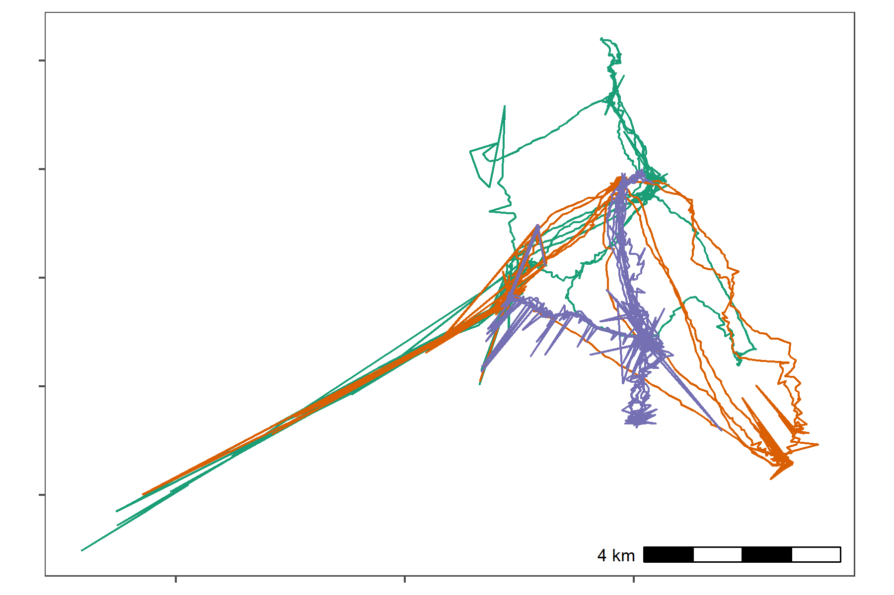
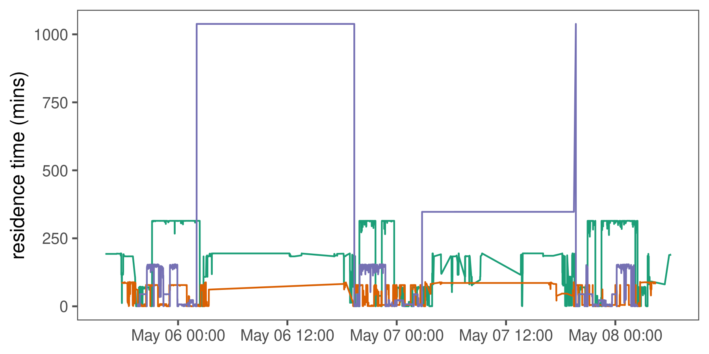
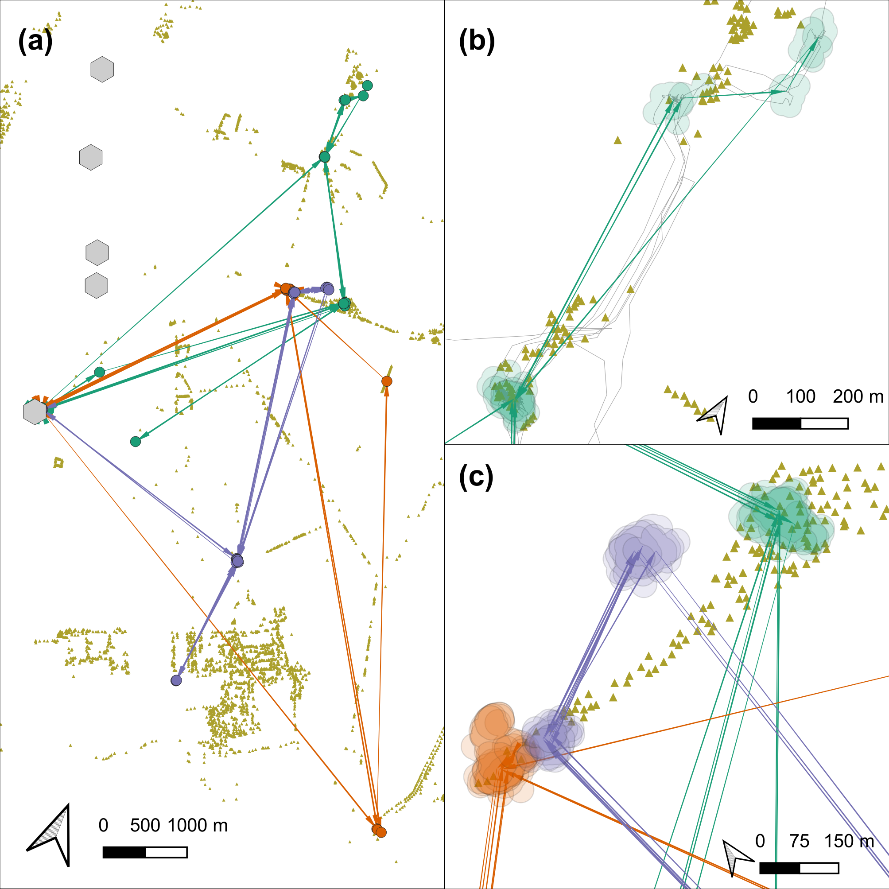

# Processing Egyptian fruit bat tracks

We show the pre-processing pipeline at work on the tracks of three Egyptian fruit bats (_Rousettus aegyptiacus_), and construct residence patches.

## Prepare libraries

```{r}
# load libs
library(data.table)
library(RSQLite)
library(atlastools)
library(ggplot2)
library(patchwork)

# prepare a palette
pal <- RColorBrewer::brewer.pal(4, "Set1")
```

## Read bat data

Read the bat data and convert to a csv file.

```{r read_bat_data}
# prepare the connection
con <- dbConnect(drv = SQLite(), dbname = "data/Three_example_bats.sql")

# list the tables
table_name <- dbListTables(con)

# prepare to query all tables
query <- sprintf('select * from \"%s\"', table_name)

# query the database
data <- dbGetQuery(conn = con, statement = query)

# disconnect from database
dbDisconnect(con)
```

Convert data to csv.

```{r}
# convert data to datatable
setDT(data)

# write data for QGIS
fwrite(data, file = "data/bat_data.csv")
```

## Sanity check: Plot bat data

```{r}
# plot bat data to examine for errors
fig_bat_raw <-
  ggplot(data)+
  geom_path(aes(X, Y,
                group = TAG,
                colour = TAG),
            show.legend = FALSE)+
  scale_colour_brewer(palette = "Dark2")+
  ggspatial::annotation_scale(location = "br")+
  ggthemes::theme_few()+
  theme(axis.text = element_blank(),
        axis.title = element_blank())+
  coord_sf(crs = 2039)
```

Save the raw data plot.

```{r}
# save to figures
ggsave(fig_bat_raw,
       filename = "figures/fig_bat_raw.png",
       dpi = 300,
       width = 6, height = 4)
```

Show the plot.



## Prepare data for filtering

### Prepare data per individual

```{r}
# split bat data by tag
# first make a copy using the data.table function copy
# this prevents the orignal data from being modified by atlastools
# functions which DO MODIFY BY REFERENCE!
data_split <- copy(data)

# now split
data_split <- split(data_split, data$TAG)
```

## Filter by covariates

No natural bounds suggest themselves, and we proceed to filter by covariates, since point outliers are obviously visible.

We use filter out positions with `SD > 20` and positions calculated using only 3 base stations.

We use the function `atl_filter_covariates`.

```{r}
# get SD.
# since the data are data.tables, no assignment is necessary
invisible(
  lapply(data_split, function(dt) {
    dt[, SD := sqrt(VARX + VARY + (2 * COVXY))]
  })
)

# filter for SD <= 20
# here, reassignment is necessary as rows are being removed
# the atl_filter_covariates function could have been used here
data_split <- lapply(data_split, function(dt) {
  dt <- atl_filter_covariates(
    data = dt,
    filters = c("SD <= 20",
                "NBS > 3")
  )
})

# check whether the filter has worked
invisible(
  lapply(data_split, function(dt) {
    assertthat::assert_that(min(dt$SD) <= 20,
                            msg = "some SDs above 20 remain")
    assertthat::assert_that(min(dt$NBS) > 3,
                            msg = "some NBS below 3 remain")
  })
)
```

### Sanity check: Plot filtered data

```{r}
# bind all individuals together
data_split <- rbindlist(data_split)
```

```{r}
# now plot over raw data
fig_bat_filter_cov <- 
  ggplot()+
  geom_point(data = data[!data_split, 
                         on = c("TAG", "X", "Y", "TIME")],
             aes(X, Y),
             col = "grey",
             shape = 4)+
  geom_path(data = data_split,
             aes(X, Y,
                 col = TAG),
             size = 0.3,
             show.legend = FALSE)+
  scale_colour_brewer(palette = "Dark2")+
  ggspatial::annotation_scale(location = "br")+
  ggthemes::theme_few()+
  theme(axis.text = element_blank(),
        axis.title = element_blank())+
  coord_sf(crs = 2039,
           xlim = range(data_split$X),
           ylim = range(data_split$Y))
```

Save the filtered data plot.

```{r}
# save to figures
ggsave(fig_bat_filter_cov,
       filename = "figures/fig_bat_filter_cov.png",
       dpi = 300,
       width = 4, height = 6)
```

Show the plot.


## Filter by speed

Some point outliers remain, and should be removed using a speed filter.

First we calculate speeds.

```{r}
# calculate speed on split data once more
data_split <- split(data_split, data_split$TAG)

# get speeds as with SD, no reassignment required for columns
invisible(
  lapply(data_split, function(dt) {
    
    # first process time to seconds
    # assign to a new column
    dt[, time := floor(TIME / 1000)]
    
    dt[, `:=`(speed_in = atl_get_speed(dt, 
                                       x = "X", y = "Y", 
                                       time = "time",
                                       type = "in"),
              speed_out = atl_get_speed(dt, 
                                       x = "X", y = "Y", 
                                       time = "time",
                                       type = "out"))]
  })
)
```

Now filter for speeds > 20 m/s (around 70 km/h).

```{r}
# filter speeds
# reassignment is required here
data_split <- lapply(data_split, function(dt) {
  dt <- na.omit(dt, cols = c("speed_in", "speed_out"))
  
  dt <- atl_filter_covariates(data = dt,
                              filters = c("speed_in <= 20",
                                          "speed_out <= 20"))
})
```

### Sanity check: Plot speed filtered data

```{r}
# bind all individuals together
data_split <- rbindlist(data_split)
```

```{r}
# now plot over raw data
fig_bat_filter_speed <-
  ggplot()+
  geom_point(data = data[!data_split, 
                         on = c("TAG", "X", "Y", "TIME")],
             aes(X, Y),
             col = "grey",
             shape = 4)+
  geom_path(data = data_split,
             aes(X, Y,
                 col = TAG),
             size = 0.3,
             show.legend = FALSE)+
  scale_colour_brewer(palette = "Dark2")+
  ggspatial::annotation_scale(location = "br")+
  ggthemes::theme_few()+
  theme(axis.text = element_blank(),
        axis.title = element_blank())+
  coord_sf(crs = 2039,
           xlim = range(data_split$X),
           ylim = range(data_split$Y))
```

Save the speed filtered data plot.

```{r}
# save to figures
ggsave(fig_bat_filter_speed,
       filename = "figures/fig_bat_filter_speed.png",
       dpi = 300,
       width = 4, height = 6)
```

Show the plot.


## Median smoothing

Apply a 5 point median smooth to the data.

```{r}
# since the function modifies in place, we shall make a copy
data_smooth <- copy(data_split)

# split the data again
data_smooth <- split(data_smooth, data_smooth$TAG)
```

Remember, **`atl_median_smooth` MODIFIES IN PLACE**.

```{r}
# apply the median smooth to each list element
# no reassignment is required as THE FUNCTION MODIFIES IN PLACE!
invisible(
  # the function arguments to atl_median_smooth
  # can be passed directly in lapply
  lapply(data_smooth, atl_median_smooth,
         time = "time", moving_window = 5)
)
```

### Sanity check: Plot smoothed data

```{r}
# recombine split up data that has been smoothed
data_smooth <- rbindlist(data_smooth)
```

```{r}
# plot the raw, filtered, and smoothed data
fig_bat_smooth <- 
  ggplot()+
  geom_point(data = data_split,
             aes(X, Y),
             col = "grey",
             shape = 4,
             show.legend = FALSE)+
  geom_path(data = data_smooth,
            aes(X, Y,
                col = TAG),
            lwd = 0.3,
            show.legend = FALSE)+
  scale_colour_brewer(palette = "Dark2")+
  ggspatial::annotation_scale(location = "br")+
  ggthemes::theme_few()+
  theme(axis.text = element_blank(),
        axis.title = element_blank())+
  coord_sf(crs = 2039,
           xlim = range(data_smooth$X),
           ylim = range(data_smooth$Y))
```

Save the smoothed data plot.

```{r}
# save to figures
ggsave(fig_bat_smooth,
       filename = "figures/fig_bat_smooth.png",
       dpi = 300,
       width = 4, height = 6)
```

Show the plot.


## Making residence patches

### Calculating residence time

First, the data is put through the `recurse` package to get residence time.

```{r}
# load recurse
library(recurse)

# split the data
data_smooth <- split(data_smooth, data_smooth$TAG)
```

Get residence time. Since bats may revisit the same features, we want to prevent confusion between frequent revisits and prolonged residence.

For this, we stop summing residence times within Z metres of a location if the animal exited the area for one hour or more.

```{r}
# get residence times

data_residence <- lapply(data_smooth, function(dt) {
  # do basic recurse
  dt_recurse <- getRecursions(
    x = dt[, c("X", "Y", "time", "TAG")],
    radius = 50,
    timeunits = "mins"
  )
  
  # get revisit stats
  dt_recurse <- setDT(
    dt_recurse[["revisitStats"]]
  )
  
  # count long absences from the area
  dt_recurse[, timeSinceLastVisit :=
          ifelse(is.na(timeSinceLastVisit), -Inf, timeSinceLastVisit)]
  dt_recurse[, longAbsenceCounter := cumsum(timeSinceLastVisit > 60),
             by = .(coordIdx)
             ]
  # get data before the first long absence of 60 mins
  dt_recurse <- dt_recurse[longAbsenceCounter < 1, ]
  
  dt_recurse <- dt_recurse[, list(
    resTime = sum(timeInside),
    fpt = first(timeInside),
    revisits = max(visitIdx)
  ),
  by = .(coordIdx, x, y)
  ]
  
  # prepare and merge existing data with recursion data
  dt[, coordIdx := seq(nrow(dt))]
  
  dt <- merge(dt, 
              dt_recurse[, c("coordIdx", "resTime")], 
              by = c("coordIdx"))
  
  setorderv(dt, "time")
})
```

### Sanity check: Residence-time time-series

```{r}
# bind the list
data_residence <- rbindlist(data_residence)

# get time as human readable
data_residence[, ts := as.POSIXct(time, origin = "1970-01-01")]
```

```{r}
fig_bat_res_timeseries <-
  ggplot()+
  geom_path(data = data_residence,
            aes(ts, resTime,
                colour = TAG),
            show.legend = F)+
  scale_color_brewer(palette = "Dark2")+
  scale_x_datetime()+
  ggthemes::theme_few()+
  coord_cartesian(ylim = c(0, 50))+
  labs(x = NULL,
       y = "residence time (mins)")
```

Save the speed filtered data plot.

```{r}
# save to figures
ggsave(fig_bat_res_timeseries,
       filename = "figures/fig_bat_res_timeseries.png",
       dpi = 300,
       width = 6, height = 3)
```

Show the plot.



### Constructing residence patches

Split the data and construct residence patches.

Some preparation is required. First, the function requires columns `x`, `y`,
`time`, and `id`.

```{r}
# add an id column
data_residence[, `:=`(id = TAG,
                      x = X, y = Y)]

# filter for residence time > 5 minutes
data_residence <- data_residence[resTime > 5, ]

# split the data
data_residence <- split(data_residence, data_residence$TAG)
```

Now segment-cluster into residence patches.

```{r}
# segment into residence patches
data_patches <- lapply(data_residence, atl_res_patch,
                       buffer_radius = 25)
```

### Getting residence patch data

We get the residence patch data as spatial `sf-MULTIPOLYGON` objects.

```{r}
# get data spatials
data_spatials <- lapply(data_patches, atl_patch_summary,
                        which_data = "spatial",
                        buffer_radius = 25)

# bind list
data_spatials <- rbindlist(data_spatials)

# convert to sf
library(sf)
data_spatials <- st_sf(data_spatials, sf_column_name = "polygons")

# assign a crs
st_crs(data_spatials) <- st_crs(2039)
```

### Write patch spatial representations

```{r}
st_write(data_spatials,
         dsn = "data/data_bat_residence_patches.gpkg")
```

Write cleaned bat data.

```{r}
data_clean <- fwrite(rbindlist(data_smooth),
                     file = "data/data_bat_smooth.csv")
```

Write patch summary.

```{r}
# get summary
patch_summary <- lapply(data_patches, atl_patch_summary)

# bind summary
patch_summary <- rbindlist(patch_summary)

# write
fwrite(patch_summary,
       "data/data_bat_patch_summary.csv")
```


## Processed bat patches

