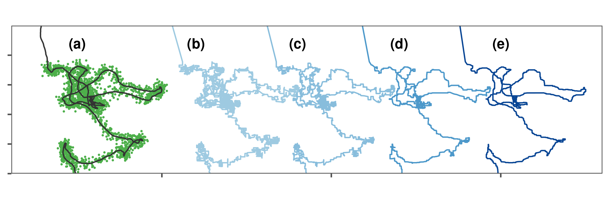
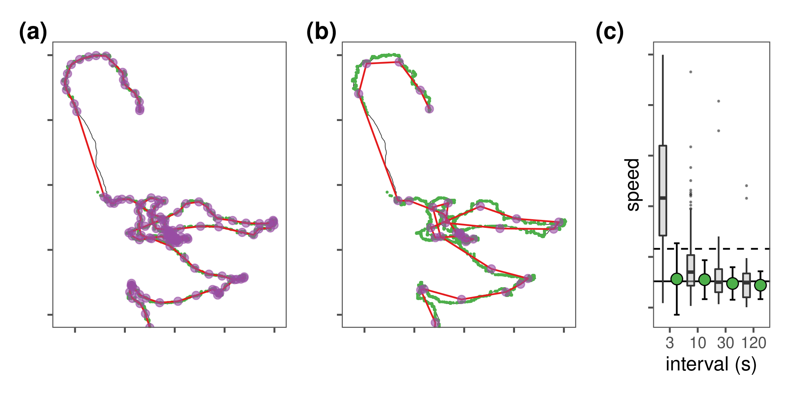

# Reducing Small-Scale Error and Aggregating Data

## Preparing Libraries and Data

We first load some useful packages and define a colour palette.

```{r}
# prep libs
library(data.table)
library(atlastools)
library(ggplot2)
library(patchwork)

# prepare a palette
pal <- RColorBrewer::brewer.pal(4, "Set1")
```

We load both the simulated, canonical data (which has no errors), as well as the data with errors which has been pre-processed to remove large-scale errors.

We also assign a variable, `window_size`, which will help identify the datasets when comparing median smooth moving window ($K$) sizes.

```{r read_sim_data_2}
# read in the data and set the window size variable
data <- fread("data/data_sim.csv")[5000:10000, ]
data[, window_size := NA]

# data with small scale errors but no reflections or outliers
data_errors <- fread("data/data_no_reflection.csv")
data_errors[, window_size := 0]
```

## Median Smoothing

We apply a median smooth with four different values of $K$, the moving window size --- 3, 5, 11, and 21 positions.
$K$ must be an odd number, but apart from that there is no correct magnitude of $K$.
Very large $K$ will lead to unrealistic tracks, while small $K$ will not result in much reduction of error.
Users are encouraged to plot their data before and after smoothing to examine the effect of different window sizes.

The `atlastools` function `atl_median_smooth` is quite fast and users can readily try multiple $K$ values as shown in the example below.

```{r}
# smooth the data over four K values
list_of_smooths <- lapply(c(3, 5, 11, 21), function(K) {
  
  data_copy <- copy(data_errors)
  
  data_copy <- atl_median_smooth(data = data_copy,
                    x = "x", 
                    y = "y",
                    time = "time",
                    moving_window = K)
  
  data_copy[, window_size := K]
})
```

We save the 11 point smoothed data.



```{r}
fwrite(list_of_smooths[[3]], file = "data/data_smooth.csv")
```

We prepare the data for plotting.

```{r}
# bind list after offset
data_plot <- mapply(function(df, offset) {
  df[, x := x + offset]
}, list_of_smooths, seq(0.4, 1.25, length.out = 4),
SIMPLIFY = F)

data_plot <- rbindlist(data_plot)
```

We prepare a plot of the smoothed data.

```{r echo=FALSE}
# prepare data to plot
# make list of data to plot
figure_median_smooth <-
  ggplot()+
  geom_point(data = data_errors,
             aes(x, y),
             col = pal[3],
             size = 0.2)+
  geom_path(data = data,
            aes(x, y),
            col = "grey20",
            lwd = 0.5)+          
  geom_path(data = data_plot,
            aes(x, y,
                col = window_size,
                group = window_size),
            show.legend = F,
            lwd = 0.5)+
  coord_equal(expand = F,
              ylim = c(0.6, 0.85),
              xlim = c(NA, 2.3),
              ratio = 1.75)+
  annotate(geom = "text",
           x = c(0.75, seq(1.1, 2, length.out = 4)),
           y = 0.82,
           label = sprintf("(%s)", letters[seq(5)]),
           fontface = "bold")+
  scale_colour_distiller(palette = "Blues", direction = 1,
                         values = c(-0.5, 1))+
  ggthemes::theme_few()+
  theme(axis.text = element_blank(),
        axis.title = element_blank())

# save figure
ggsave(figure_median_smooth, filename = "figures/fig_04_median_smooth.png",
       width = 170, height = 170 / 3, units = "mm")
```

## Thinning Data by Aggregation

Evenly thinning data is a good idea if statistical methods require even sampling, or if the volume of data is too large for statistical packages to efficiently handle it. In `R`, both may be true at once.

Here, we demonstrate thinning by aggregation on data that has been median smoothed using a $K$ of 11.

```{r}
# choose the 11 point median smooth data
data_agg <- fread("data/data_smooth.csv")

# get list of aggregated data
list_of_agg <- lapply(c(3, 10, 30, 120), function(z) {
  
  data_return <- atl_thin_data(data = data_agg,
                            interval = z,
                            method = "aggregate")
  
  data_return[, interval := z]
  
  return(data_return)
})

# get mean speed estimate and sd
speed_agg_smooth <- 
  lapply(list_of_agg, function(df) {
    na.omit(df)
    df[, speed := atl_get_speed(df)]
    df[, list(median = median(speed, na.rm = T),
              sd = sd(speed, na.rm = T),
              interval = first(interval))]
  })

# bind
speed_agg_smooth <- rbindlist(speed_agg_smooth)
```

```{r echo=FALSE}
### plot figures
fig_agg_data <-
  lapply(list_of_agg, function(df) {
    ggplot(df)+
      geom_path(data = data,
                aes(x, y),
                col = "grey20",
                size = 0.2)+
      geom_point(data = data_agg,
                 aes(x, y),
                 size = 0.2,
                 col = pal[3])+
      geom_path(aes(x,y), 
                col = pal[1])+
      geom_point(aes(x,y,
                     group = interval),
                 shape = 19,
                 col = pal[4],
                 size = 2,
                 alpha = 0.6,
                 show.legend = F)+
      ggthemes::theme_few()+
      theme(axis.text = element_blank(),
            axis.title = element_blank(),
            panel.background = element_rect(fill = "white"))+
      coord_cartesian(ylim = c(0.6, NA))
  })
```


## Aggregation Before Reducing Positioning Errors

Users may rightly wonder whether they can get away with aggregating their data, using a median aggregation function, and reduce data volumes, correct uneven sampling frequency, and reduce large-scale errors all in one go.

The answer to most questions in ecology is, "It depends". Median aggregation before correcting positioning errors can indeed be advantageous; for instance for faster visualisation while preserving the broad structure of a track.

However, there are drawbacks. The main one is that information is lost in the aggregation process, lending less power to steps such as smoothing applied after aggregation.
Further, aggregation (and indeed any kind of thinning) results in significantly different estimates of speed and distance from the real speed.

We show the effect of aggregating before any error correction here.

```{r}
# read data with errors
data_errors <- fread("data/data_errors.csv")
  
# aggregate before correction
list_of_agg <- lapply(c(3, 10, 30, 120), function(z) {
  data_return <- atl_thin_data(data = data_errors,
                            interval = z,
                            method = "aggregate")
  data_return[, interval := z]
  data_return[, speed := atl_get_speed(data_return)]
  return(data_return)
})

# get real speed
data[, speed := atl_get_speed(data)]
```

### Comparing median aggregation with and without smoothing

```{r}
# now plot distribution of speed
data_agg <- rbindlist(list_of_agg)
```

```{r echo=FALSE}
# show boxplot of speed
fig_agg_speed <-
  ggplot(data_agg)+
  geom_hline(yintercept =
               1 + quantile(data$speed, na.rm = T,
                        probs = c(0.5, 0.95)),
             lty = c(1, 2))+
  geom_errorbar(data = speed_agg_smooth,
                aes(x = factor(interval),
                    ymin = 1 + median - sd,
                    ymax = 1 + median + sd),
                width = 0.2,
                position = position_nudge(x = 0.25)) +
  geom_point(data = speed_agg_smooth,
             aes(x = factor(interval),
                 y = 1 + median),
             shape = 21,
             size = 3,
             fill = pal[3],
             position = position_nudge(x = 0.25)) +
  geom_boxplot(aes(factor(interval), 1 + speed),
               position = position_nudge(x = -0.25,),
               fill = "grey",
               alpha = 0.5,
               show.legend = F, 
               width = 0.25, 
               outlier.size = 0.2)+
  scale_y_log10(label = scales::comma,
                limits = c(NA, 1.005))+
  ggthemes::theme_few()+
  theme(axis.text.y = element_blank())+
  labs(x = "interval (s)",
       y = "speed")
```

```{r echo=FALSE}
# make combined figure
fig_aggregate <-
  wrap_plots(append(fig_agg_data[3:4], list(fig_agg_speed)),
             design = "AABBC")+
  plot_annotation(tag_levels = "a",
                  tag_prefix = "(",
                  tag_suffix = ")") &
  theme(plot.tag = element_text(face = "bold"))

# save figure
ggsave(fig_aggregate,
       filename = "figures/fig_05_thinning.png",
       width = 170, height = 85, units = "mm")
```



Thinning a movement track using median aggregation preserves track structure, but affects essential track metrics such as speed.
**(a, b)** Movement tracks with a canonical interval of 1s aggregated over intervals of **(a)** 10 and **(b)** 30 seconds, without removing large- or small-scale positioning errors. All symbols represent positions in the aggregated track, with the size of the symbol representing the standard deviation at each position.
Blue crosses represent positions with speed $\leq$ the 95^th percentile of canonical speeds, while red triangles represent positions with speed $\geq$ 95^th percentile of canonical speeds.
**(c)** Boxplot of instantaneous speeds after median aggregation of a 1s interval track over intervals of 3, 10, 30, and 120 seconds, but without the removal of positioning errors. The mean and 95^th percentile of speed in the canonical track are shown as solid and dashed lines, respectively. 
Aggregation without reducing positioning errors can result in speed estimates that are substantially different from the true speed.
