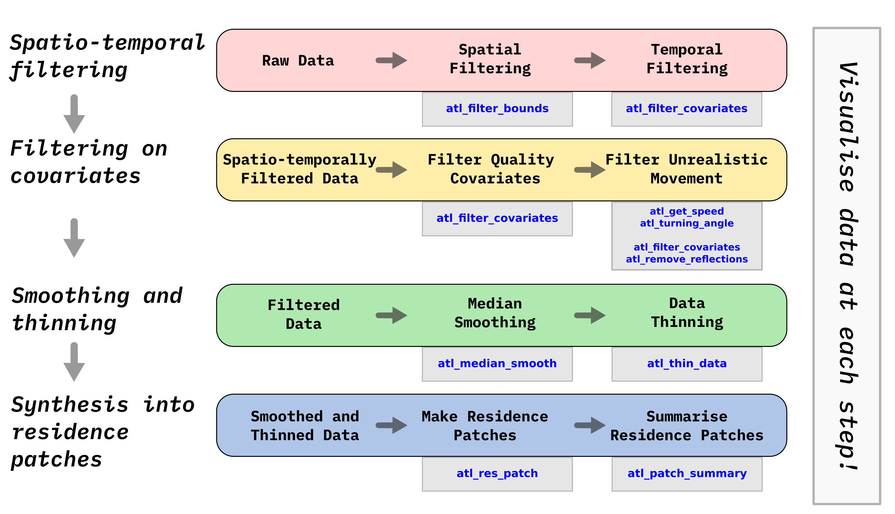

--- 
knit: "bookdown::render_book"
title: "A Rough Guide to Pre-processing High-Frequency Animal Tracking Data"
author: "Pratik R. Gupte and others"
date: "`r Sys.Date()`"
site: bookdown::bookdown_site
output: bookdown::pdf_book
documentclass: book
bibliography: [references.bib]
biblio-style: apalike
link-citations: yes
link-citations: yes
github-repo: pratikunterwegs/atlas-best-practices
description: "Source code for a guide to pre-processing high-frequency tracking data."
---

# Abstract

Data cleaning is a ubiquitous pre-processing step in analysis pipelines, and its automation is essential for large data volumes such as those generated in animal tracking studies using high-frequency Time-of-Arrival (TOA) systems.
Users of systems such as ATLAS must contend with two intertwined data cleaning challenges: (1) reducing positioning errors, and (2) the high volume of data itself.
Making biological inferences from data with positioning errors is not straightforward, and processing large data volumes is computationally intensive.
Though reducing positioning error is widely recommended, users are without uniform guidance on how to go about this, and lack a common set of computationally efficient tools.
Further, many methods that synthesize movement tracks for ecological inference are either (1) not suited to very large datasets, or (2) not intuitive to understand in terms of the tracked animal's biology.

In this article we introduce a pipeline to pre-process high-frequency animal tracking data in order to prepare it for subsequent analysis.
We demonstrate this pipeline on simulated movement data to which we have randomly added positioning errors.
This pipeline is suited to any tracking study in which the high data volume combined with knowledge of the tracked individuals’ biology can be used to smooth out positioning errors. 
We further suggest how large volumes of cleaned data may be synthesized into biologically meaningful ‘residence patches’, and demonstrate how this accurately captures animal space-use.
Finally, we introduce the `R` package `atlastools` which provides fast implementations of the methods we describe. 
Though aimed at ATLAS systems, `atlastools` can be used with any time-series animal movement data, and we demonstrate its usage with both simulated and empirical examples.

