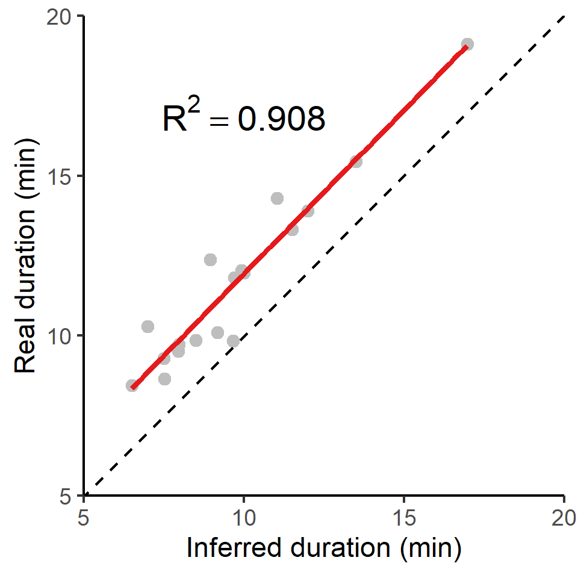

# Validating the Residence Patch Method with Calibration Data

Here we show how the residence patch method [@barraquand2008; @bijleveld2016; @oudman2018] accurately estimates the duration of known stops in a track collected as part of a calibration exercise in the Wadden Sea. These data can be accessed from the `data` folder at this link: https://doi.org/10.5281/zenodo.4287462. These data are more fully reported in [@beardsworth2021].

## Outline of Cleaning Steps

We begin by preparing the libraries we need, and installing `atlastools` from Github.
After installing `atlastools`, we visualise the data to check for location errors, and find a single outlier position approx. 15km away from the study area (Fig. 1.1, 1.2).
This outlier is removed by filtering data by the X coordinate bounds using the function `atl_filter_bounds`; X coordinate bounds $\leq$ 645,000 in the UTM 31N coordinate reference system were removed (n = 1; remaining positions = 50,815; Fig. 1.2).
We then calculate the incoming and outgoing speed, as well as the turning angle at each position using the functions `atl_get_speed` and `atl_turning_angle` respectively, as a precursor to targeting large-scale location errors in the form of point outliers.
We use the function `atl_filter_covariates` to remove positions with incoming and outgoing speeds $\geq$ the speed threshold of 15 m/s (n = 13,491, 26.5%; remaining positions = 37,324, 73.5%; Fig. 1.3; main text Fig. 7.b).
This speed threshold is chosen as the fastest boat speed during the experiment, 15 m/s.
Finally, we target small-scale location errors by applying a median smoother with a moving window size $K$ = 5 using the function `atl_median_smooth` (Fig. 1.4; main text Fig. 7.c).
Smoothing does not reduce the number of positions.
We thin the data to a 30 second interval leaving 1,803 positions (4.8\% positions of the smoothed track)


## Install `atlastools` from Github

`atlastools` is available from Github and is archived on Zenodo [@gupte2020a].
It can be installed using `remotes` or `devtools`. Here we use the `remotes` function `install_github`.

```{r install_atlastools, eval=TRUE}
if (!require(remotes)) {
  install.packages("remotes", repos = "http://cran.us.r-project.org")
}

# installation using remotes
if (!require(atlastools)) {
  remotes::install_github("pratikunterwegs/atlastools", upgrade = FALSE)
}
```

### A Note on `:=` {-}

The `atlastools` package is based on `data.table`, to be fast and efficient [@dowle2020].
A key feature is modification in place, where data is changed without making a copy.
This is already implemented in `R` and will be familiar to many users as `data_frame$column_name <- values`.

The `data.table` way of writing this assignment would be `data_frame[, column_name := values]`.
We use this syntax throughout, as it provides many useful shortcuts, such as multiple assignment:

`data_frame[, c("col_a", "col_b") := list(values_a, values_b)]`

Users can use this special syntax, and will find it convenient with practice, but there are _no_ cases where users _must_ use the `data.table` syntax, and can simply treat the data as a regular `data.frame`. However, users are advised to convert their `data.frame` to a `data.table` using the function `data.table::setDT()`.


## Prepare libraries

First we prepare the libraries we need. Libraries can be installed from CRAN if necessary.

```{r eval=TRUE}
# for data handling
library(data.table)
library(atlastools)
library(stringi)

# for recursion analysis
library(recurse)

# for plotting
library(ggplot2)
library(patchwork)

# making a colour palette
pal <- RColorBrewer::brewer.pal(5, "Set1")
pal[3] <- "seagreen"
```

## Access data and preliminary visualisation

First we access the data from a local file using the `data.table` package [@dowle2020].

In all, we aim to keep three versions of the data: (1) `data_raw`, the entirely unprocessed data, (2) `data`, the working version, and (3) `data_unproc`, data that has been partially processed, but which is one step behind `data`. This allows us to better illustrate the pre-processing steps, and prevents us from irreversibly modifying our data --- at best, we would have to re-run many pre-processing steps, and at worst, we might overwrite the original data on disk.

We look at the first few rows, using `head()`. We then visualise the raw data.

```{r, eval=TRUE}
# read and plot example data
data <- fread("data/atlas1060_allTrials_annotated.csv")
data_raw <- copy(data)

# see raw data
head(data_raw)
```

Here we show how data can be easily visualised using the popular plotting package `ggplot2`.
Note that we plot both the points (`geom_point`) and the inferred path between them (`geom_path`), and specify a geospatial coordinate system in metres, suitable for the Dutch Wadden Sea (UTM 31N; ESPG code:32631; `coord_sf`).
We save the output to file for future reference.

Since plot code can become very lengthy and complicated, we omit showing further plot code in versions of this document rendered as PDF or HTML; it can however be seen in the online `.Rmd` version.

```{r echo=TRUE}
# plot data
fig_data_raw <-
  ggplot(data) +
  geom_path(aes(x, y),
    col = "grey", alpha = 1, size = 0.2
  ) +
  geom_point(aes(x, y),
    col = "grey", alpha = 0.2, size = 0.2
  ) +
  ggthemes::theme_few() +
  theme(
    axis.title = element_blank(),
    axis.text = element_blank()
  ) +
  coord_sf(crs = 32631)

# save figure
ggsave(fig_data_raw,
  filename = "supplement/figures/fig_calibration_raw.png",
  width = 185 / 25
)
```


## Filter by bounding box

We first save a copy of the data, so that we can plot the unprocessed data with the cleaned data plotted over it for comparison. Here, `data_unproc`, `data`, and `data_raw` are still the same, since no pre-processing steps have been applied yet.

```{r}
# make a copy using the data.table copy function
data_unproc <- copy(data)
```

We then filter by a bounding box in order to remove the point outlier to the far south east of the main track. We use the `atl_filter_bounds` functions using the `x_range` argument, to which we pass the limit in the UTM 31N coordinate reference system.
This limit is used to exclude all points with an X coordinate < 645,000.

We then plot the result of filtering, with the excluded point in black, and the points that are retained in green. After this stage, `data` is filtered and 'ahead' of `data_raw` and `data_unproc`, which are still the same. This pattern will repeat throughout this material.

```{r}
# remove inside must be set to falses
data <- atl_filter_bounds(
  data = data,
  x = "x", y = "y",
  x_range = c(645000, max(data$x)),
  remove_inside = FALSE
)
```

```{r echo=FALSE}
# plot data
fig_data_bbox <-
  ggplot() +
  geom_path(
    data = data_raw,
    aes(x, y),
    col = "grey", alpha = 0.5, size = 0.3
  ) +
  geom_point(
    data = data_raw,
    aes(x, y,
      col = x > 645000
    ),
    alpha = ifelse(data_raw$x > 645000, 1, 1),
    size = ifelse(data_raw$x > 645000, 0.3, 4),
    shape = ifelse(data_raw$x > 645000, 16, 4),
    show.legend = F
  ) +
  scale_colour_manual(values = c(pal[1], pal[3])) +
  geom_vline(
    xintercept = 645000,
    col = "grey", lty = 2
  ) +
  ggspatial::annotation_scale(location = "br") +
  ggthemes::theme_few() +
  theme(
    axis.text = element_blank(),
    axis.title = element_blank()
  ) +
  coord_sf(crs = 32631)

# save result
ggsave(fig_data_bbox,
  filename = "supplement/figures/fig_calib_bbox.png",
  width = 185 / 25
)
```


## Filter trajectories

### Handle time

Time in ATLAS tracks is represented by 64-bit integers (type `long`) that specify time in milliseconds, starting from the beginning of 1970 (the UNIX epoch). This representation of time is called `POSIX` time and is usually specified in seconds, not milliseconds. 

Since about 1.6 billion seconds have passed since the beginning of 1970, current `POSIX` times in milliseconds cannot be represented by R's built-in 32-bit integers. A naive conversion results in truncation of out-of-range numbers leading to huge errors (dates many thousands of years in the future).

R does not natively support 64-bit integers. One option is to use the bit64 package, which adds 64-bit integer support to R. 

A simpler solution is to convert the times to R's built in `double` data type (also called `numeric`), which uses a 64-bit floating point representation. This representation can represent integers with up to 16 digits without error; we only need 13 digits to represent the number of milliseconds since 1970, so the conversion is error free. We can also perform the conversion and then divide by 1000 so that times are represented in seconds, not milliseconds; this simplifies speed estimation.

If second-resolution is accurate enough (it is for our purposes), the solution that we use is to divide times by 1000 to reduce the resolution from milliseconds to seconds and then to convert the time stamps to R integers.
In the spirit of not destroying data, we create a second lower-case column called `time` to store this 

```{r}
# divide by 1000, convert to integer
data[, time := as.integer(
  as.numeric(TIME) / 1000
)]
```

### Add speed and turning angle

```{r}
# add incoming and outgoing speed
data[, `:=`(
  speed_in = atl_get_speed(data,
    x = "x",
    y = "y",
    time = "time"
  ),
  speed_out = atl_get_speed(data, type = "out")
)]

# add turning angle
data[, angle := atl_turning_angle(data = data)]
```

Compare number of receivers and SD and speed.

```{r, eval=FALSE, echo=FALSE}
data_nbs <- data[, c("NBS", "SD", "speed_in", "VARX", "VARY")]
data_nbs <- melt(
  data_nbs,
  id.vars = c("NBS")
)
```

```{r, eval=FALSE, echo=FALSE}
# plot heatmaps
fig_sd_nbs <-
  ggplot(data_nbs) +
  geom_jitter(
    aes(factor(NBS), SD, col = speed_in),
    size = 0.2,
    alpha = 0.4
  ) +
  geom_hline(
    yintercept = 100,
    lty = 2, col = "grey"
  ) +
  geom_vline(
    xintercept = 1.5,
    lty = 2, col = "grey"
  ) +
  scale_colour_viridis_c(
    option = "G", direction = -1,
    limits = c(0, 20),
    na.value = "red"
  ) +
  coord_cartesian(
    expand = F,
    xlim = c(0.5, 6),
    ylim = c(1, 1e3)
  ) +
  scale_y_log10() +
  theme_classic() +
  theme(
    # panel.border = element_rect(
    #   colour = "black",
    #   fill = "NA"
    # ),
    legend.key.width = unit(2, "mm"),
    legend.key.height = unit(5, "mm"),
    legend.position = c(0.8, 0.85),
    legend.background = element_blank()
  ) +
  # facet_wrap(~variable)+
  labs(
    colour = "Speed (m/s)",
    x = "# WATLAS receivers",
    y = "Positioning error (SD)"
  )

ggsave(
  fig_sd_nbs,
  filename = "supplement/figures/fig_sd_nbs.png",
  height = 5,
  width = 3
)
```


### Get 90th percentile of speed and angle

```{r}
# use sapply
speed_angle_thresholds <-
  sapply(data[, list(speed_in, speed_out, angle)],
    quantile,
    probs = 0.9, na.rm = T
  )
```

```{r echo=FALSE}
# plot filtered data
fig_speed_outliers <-
  ggplot() +
  geom_point(
    data = data,
    aes(x, y,
      col = speed_in < 25.6
    ),
    size = 0.3, alpha = 0.5,
    show.legend = F
  ) +
  annotate(
    geom = "rect",
    xmin = 650785, xmax = 653250,
    ymin = 5904450, ymax = 5906133,
    fill = NA, col = "grey20"
  ) +
  annotate(
    geom = "text",
    x = 653250,
    y = 5906133 + 500,
    label = "(b)",
    # size = 10,
    fontface = "bold"
  ) +
  annotate(
    geom = "rect",
    ymin = 5901650, ymax = 5903100,
    xmin = 650000, xmax = 650600,
    fill = NA, col = "grey20"
  ) +
  annotate(
    geom = "text",
    y = 5901650 - 300,
    x = 650600,
    label = "(c)",
    # size = 10,
    fontface = "bold"
  ) +
  scale_color_manual(values = c("grey", pal[3])) +
  ggthemes::theme_few() +
  theme(
    axis.text = element_blank(),
    axis.title = element_blank()
  ) +
  ggspatial::annotation_scale(location = "tl") +
  coord_sf(crs = 32631)

# save
ggsave(fig_speed_outliers,
  filename = "supplement/figures/fig_speed_outlier.png",
  width = 170 / 25, height = 170 / 25
)
```

### Filter on speed

Here we use a speed threshold of 15 m/s, the fastest known boat speed.
We then plot the data with the extreme speeds shown in grey, and the positions retained shown in green.

Here, `data_unproc` moves 'ahead' of `data_raw`, and holds the data filtered by a bounding box --- `data` is also moving ahead, and will be filtered on speed.

```{r}
# make a copy
data_unproc <- copy(data)

# remove speed outliers
data <- atl_filter_covariates(
  data = data,
  filters = c("(speed_in < 15 & speed_out < 15)")
)

# recalculate speed and angle
data[, `:=`(
  speed_in = atl_get_speed(data,
    x = "x",
    y = "y",
    time = "time"
  ),
  speed_out = atl_get_speed(data, type = "out")
)]

# add turning angle
data[, angle := atl_turning_angle(data = data)]
```


## Smoothing the trajectory

We then apply a median smooth over a moving window ($K$ = 5).
This function modifies in place, and does not need to be assigned to a new variable.
We create a copy of the data before applying the smooth so that we can compare the data before and after smoothing.

```{r}
# apply a 5 point median smooth, first make a copy
data_unproc <- copy(data)

# now apply the smooth
atl_median_smooth(
  data = data,
  x = "x", y = "y", time = "time",
  moving_window = 5
)
```

```{r, echo=FALSE}
# make zoomed in figures
fig_smooth <-
  ggplot() +
  geom_path(
    data = data_raw[!data_unproc, on = c("x", "y")],
    aes(x, y),
    col = "grey90",
    size = 0.1
  ) +
  geom_point(
    data = data_raw[!data_unproc, on = c("x", "y")],
    aes(x, y),
    col = "grey",
    shape = 4,
    size = 0.4
  ) +
  geom_point(
    data = data,
    aes(x, y),
    col = pal[3],
    shape = 1,
    stroke = 1,
    alpha = 0.5
  ) +
  coord_cartesian(
    xlim = c(650785, 653250),
    ylim = c(5904450, 5906133),
    expand = F
  ) +
  ggthemes::theme_few() +
  theme(
    axis.title = element_blank(),
    axis.text = element_blank()
  ) +
  ggspatial::annotation_scale(location = "br")

ggsave(fig_smooth,
  filename = "supplement/figures/fig_calib_median_smooth.png",
  width = 90 / 25, height = 90 / 25
)
```


## Thinning the data

Next we thin the data by aggregation to demonstrate thinning after median smoothing.
Following this, we plot the median smooth and thinning by aggregation.

```{r}
# save a copy
data_unproc <- copy(data)

# remove columns we don't need
data <- data[, !c("tID", "Timestamp", "id", "TIME", "UTCtime")]

# thin to a 30s interval
data_thin <- atl_thin_data(
  data = data,
  interval = 30,
  method = "aggregate",
  id_columns = "TAG"
)
```


```{r echo=FALSE}
# make zoomed in figures
fig_smooth_thin <-
  ggplot() +
  geom_path(
    data = data_raw[!data_unproc, on = c("x", "y")],
    aes(x, y),
    col = "grey90",
    size = 0.1
  ) +
  geom_point(
    data = data_raw[!data_unproc, on = c("x", "y")],
    aes(x, y),
    col = "grey",
    shape = 4,
    size = 0.4
  ) +
  geom_point(
    data = data_thin,
    aes(x, y, size = count),
    col = pal[4],
    alpha = 0.8,
    shape = 0, show.legend = F
  ) +
  geom_point(
    data = data_unproc,
    aes(x, y),
    col = pal[3],
    shape = 16
  ) +
  scale_size(range = c(2, 6)) +
  coord_cartesian(
    xlim = c(650785, 653250),
    ylim = c(5904450, 5906133),
    expand = F
  ) +
  ggthemes::theme_few() +
  theme(
    axis.title = element_blank(),
    axis.text = element_blank()
  ) +
  ggspatial::annotation_scale(location = "br")

ggsave(fig_smooth_thin,
  filename = "supplement/figures/fig_calib_smooth_thin.png",
  width = 90 / 25, height = 90 / 25, dpi = 300
)
```

```{r echo=FALSE}
# make combined walkthrough figure
figure_walkthrough <-
  wrap_plots(
    list(
      fig_speed_outliers, fig_smooth_thin
    ),
    design = "AB"
  )

# # save combined figure
ggsave(figure_walkthrough,
  filename = "supplement/figures/fig_walkthrough.png",
  height = 90, width = 170, units = "mm"
)
```


## Residence patches

### Get waypoint centroids

We subset the annotated calibration data to select the waypoints and the positions around them which are supposed to be the locations of known stops. Since each stop was supposed to be 5 minutes long, there are multiple points in each known stop.

```{r}
data_res <- data_unproc[stri_detect(tID, regex = "(WP)")]
```

From this data, we get the centroid of known stops, and determine the time difference between the first and last point within 50 metres, and within 10 minutes of the waypoint positions' median time.

Essentially, this means that the maximum duration of a stop can be 20 minutes, and stops above this duration are not expected.

```{r}
# get centroid
data_res_summary <- data_res[, list(
  nfixes_real = .N,
  x_median = median(x),
  y_median = median(y),
  t_median = median(time)
),
by = "tID"
]

# now get times 10 mins before and after
data_res_summary[, c("t_min", "t_max") := list(
  t_median - (10 * 60),
  t_median + (10 * 60)
)]

# manually get the duration of the stops
wp_data <- mapply(function(l, u, mx, my) {

  # first select all data whose timestamp is between
  # the upper and lower bounds of the stop (l = lower, u = upper)
  tmp_data <- data_unproc[inrange(time, l, u), ]

  # calculate the distance between the positions selected above
  # and the median X and Y coordinates of the stop (centroid)
  tmp_data[, distance := sqrt((mx - x)^2 + (my - y)^2)]

  # keep positions that are within 50m of the centroid
  tmp_data <- tmp_data[distance <= 50, ]

  # get the duration of the stop as the difference between
  # the minimum and maximum times of the positions retained above
  return(diff(range(tmp_data$time)))
}, data_res_summary$t_min, data_res_summary$t_max,
data_res_summary$x_median, data_res_summary$y_median,

# this specifies that a vector, rather than a list, is returned
SIMPLIFY = TRUE
)

# get waypoint summary --- rounding median coordinates to the nearest 100m
patch_summary_real <- data_res_summary[, list(
  nfixes_real = nfixes_real,
  x_median = round(median(x_median), digits = -2),
  y_median = round(median(y_median), digits = -2)
),
by = "tID"
]

# add real duration
patch_summary_real[, duration_real := wp_data]

# write to file
fwrite(patch_summary_real, "data/data_real_watlas_stops.csv")
```

### Prepare data

First, we filter data where we know the animal (or in this case, the human-carried tag) spent some time at or near a position, as this is the first step to identify residence patches. 
One way of doing this is by filtering out positions with speeds above which the tag (ideally on an animal) is likely to be in transit.
Rather than filtering on instantaneous speed estimates, filtering on a median smoothed speed estimate is more reliable.

### Exclude transit points

Here, we aim to remove locations where the tag is clearly moving, by filtering on smoothed speed, using a one-way median smooth with $K$ = 5.
The speeds between points must be recalculated here because the speed metrics now associated with the data refer to the raw data before median smoothing.

```{r}
# get 4 column data
data_for_patch <- copy(data_thin)

# recalculate speeds, removing speed out
data_for_patch[, c("speed_in", "speed_out") := list(
  atl_get_speed(data_for_patch),
  NULL
)]

# get smoothed speed
data_for_patch[, speed_smooth := runmed(speed_in, k = 5)]

# save recurse data
fwrite(data_for_patch, file = "data/data_calib_for_patch.csv")
```

### Run residence patch method

We subset data with a smoothed speed < 2 m/s in order to construct residence patches.
From this subset, we construct residence patches using the parameters: `buffer_radius` = 5 metres, `lim_spat_indep` = 50 metres, `lim_time_indep` = 5 minutes, and `min_fixes` = 3.

```{r}
# assign id as tag
data_for_patch[, id := as.character(TAG)]

# on known residence points
patch_res_known <- atl_res_patch(
  data = data_for_patch[speed_smooth < 2, ],
  buffer_radius = 5,
  lim_spat_indep = 50,
  lim_time_indep = 5,
  min_fixes = 3
)
```

### A note on summary statistics {-}

Users specifying a `summary_variable` should make sure that the variable for which they want a summary statistic is present in the data.
For instance, requesting mean speed by passing `summary_variable = "speed"` and `summary_function = "mean"` to `atl_res_patch`, should make sure that their data includes a column called `speed`.

### Get spatial and summary objects

Having classified slow-moving or stationary behavioural bouts into residence patches, many animal ecologists would most probably wish to know something about the environment at or around these patches --- more accurately, around the point locations classified into patches.

How exactly this is done depends on the relative spatial scales of the residence patches and the resolution of the environmental data layer.
For instance, a residence patch some 40m -- 50m wide or long may be overlaid on an environmental raster layer with a resolution of 250m.
In this case, sampling the layer at the centroid of the patch is as good as sampling at all the patch's points -- the mean is unlikely to differ (except at raster pixel boundaries).

On the other hand, a raster with a 10m resolution (e.g. Sentinel 1 and 2 data) may be worthwhile to sample at all the locations comprising a residence patch, so as to calculate the mean and variance of environmental conditions.

Furthermore, many (if not all) animals integrate cues from quite a distance (10m -- 100m) when making decisions on when to settle in an area, and when to leave. Thus it can also be useful to sample environmental layers not at point locations, but to extract the mean and variance from an _area_, or a buffer, around the animal's point locations.

We have provided a convenient function to get either _(1)_ the points (classified into patches), or _(2)_ a summary ouput of the residence patches (i.e., the median coordinates and their attributes), or finally _(3)_ a spatial buffer around the points from _(1)_. 
This function, `atl_patch_summary` implements these options using the `which_data` argument, where the options are _(1)_ "points", _(2)_ "summary", or _(3)_ "spatial".

Here, we choose option (3), using a spatial buffer of 20m. The distance of the bufffer is passed to the argument `buffer_radius`.

```{r}
# for the known and unkniwn patches
patch_sf_data <- atl_patch_summary(patch_res_known,
  which_data = "spatial",
  buffer_radius = 20
)

# assign crs
sf::st_crs(patch_sf_data) <- 32631

# get summary data
patch_summary_data <- atl_patch_summary(patch_res_known,
  which_data = "summary"
)
```

At this stage, users have successfully pre-processed their data from raw positions to residence patches.
Residence patches are essentially `sf` objects and can be visualised using the `sf` method for `plot`; for instance `plot(patch_sf_data)`.
Further sections reproduce the analyses in the main manuscript.

---


### Prepare to plot data

We read in the island's shapefile to plot it as a background for the residence patch figure.

```{r message=FALSE, warning=FALSE}
# read griend and hut
griend <- sf::st_read("data/griend_polygon/griend_polygon.shp", quiet = TRUE)
hut <- sf::st_read("data/griend_hut.gpkg", quiet = TRUE)
```

```{r echo=FALSE}
# patch with residence points and all patches
fig_basic_residence <-
  ggplot() +
  geom_sf(data = griend, fill = "antiquewhite") +
  geom_point(
    data = data_res_summary,
    aes(x_median, y_median),
    size = 10,
    shape = 2,
    stroke = 1,
    col = pal[4],
    alpha = 1
  ) +
  geom_sf(
    data = hut,
    size = 10, shape = 2,
    stroke = 1,
    col = pal[1]
  ) +
  geom_path(
    data = data_for_patch,
    aes(x, y),
    show.legend = F,
    size = 0.3,
    col = "grey"
  ) +
  geom_point(
    data = data_for_patch,
    aes(x, y),
    show.legend = F,
    shape = 1, col = "grey50"
  ) +
  geom_sf(
    data = patch_sf_data[patch_sf_data$duration >= 5 * 60, ],
    fill = pal[3],
    col = pal[3],
    alpha = 0.3
  ) +
  scale_colour_manual(values = c("grey50", pal[3])) +
  scale_shape_manual(values = c(4, 19)) +
  ggspatial::annotation_scale(location = "tl") +
  ggthemes::theme_few() +
  theme(
    axis.text = element_blank(),
    axis.title = element_blank(),
    panel.background = element_rect(fill = "aliceblue")
  ) +
  coord_sf(
    crs = 32631,
    expand = F,
    ylim = c(5901650, 5903100),
    xlim = c(650000, 650600)
  )
```

```{r echo=FALSE}
ggsave(fig_basic_residence,
  filename = "supplement/figures/fig_calib_residence.png",
  height = 170, width = 80, units = "mm"
)
```

![Classifying thinned data into residence patches yields robust estimates of the duration of known stops. The island of Griend (53.25$^{\circ}$N, 5.25$^{\circ}$E) is shown in beige. Residence patches (green polygons; function parameters in text) correspond well to the locations of known stops (purple triangles). However, the algorithm identified all areas with prolonged residence, including those which were not intended stops (n = 12; green polygons without triangles). The field station on Griend (red triangle) was not intended to be a stop, but the tags were stored here before the trial, and the method correctly picked up this prolonged stationary data as a residence patch. The algorithm failed to find two stops of 6 and 15 seconds duration, since these were lost in the data thinning step (purple triangle without green polygon shows one of these). The area shown is the lower rectangle in Fig. 1.3.](figures/fig_calib_residence.png)

## Compare patch metrics

We filter these data to exclude one exceedingly long outlier of about an hour (WP080).

```{r}
# round median coordinate for inferred patches
patch_summary_inferred <-
  patch_summary_data[
    ,
    c(
      "x_median", "y_median",
      "nfixes", "duration", "patch"
    )
  ][, `:=`(
    x_median = round(x_median, digits = -2),
    y_median = round(y_median, digits = -2)
  )]
```

We add data from the known patches, matching by X and Y median.

```{r }
# join with respatch summary
patch_summary_compare <-
  merge(patch_summary_real,
    patch_summary_inferred,
    on = c("x_median", "y_median"),
    all.x = TRUE, all.y = TRUE
  )

# drop nas
patch_summary_compare <- na.omit(patch_summary_compare)

# drop patch around WP080
patch_summary_compare <- patch_summary_compare[tID != "WP080", ]
```

7 patches are identified where there are no waypoints, while 2 waypoints are not identified as patches. These waypoints consisted of 6 and 15 (WP098 and WP092) positions respectively, and were lost when the data were aggregated to 30 second intervals.

### Linear model durations

We run a simple linear model.

```{r}
# get linear model
model_duration <- lm(duration_real ~ duration,
  data = patch_summary_compare
)

# get R2
summary(model_duration)

# write to file
writeLines(
  text = capture.output(
    summary(model_duration)
  ),
  con = "data/model_output_residence_patch.txt"
)
```

```{r echo=FALSE}
# make figure comparing different methods
figure_lm_duration <-
  ggplot() +
  geom_point(
    data = patch_summary_compare,
    aes(
      duration,
      duration_real
    ),
    show.legend = F,
    size = 2, col = "grey"
  ) +
  geom_smooth(
    data = patch_summary_compare,
    aes(
      duration,
      duration_real
    ),
    se = F,
    col = pal[1],
    method = "lm",
    show.legend = F
  ) +
  annotate(
    geom = "text",
    x = 600, y = 1020,
    size = 5,
    label = "R^2 == 0.908",
    parse = T, family = "Arial"
  ) +
  scale_x_continuous(
    breaks = 60 * seq(5, 20, 5),
    labels = seq(5, 20, 5)
  ) +
  scale_y_continuous(
    breaks = 60 * seq(5, 20, 5),
    labels = seq(5, 20, 5)
  ) +
  coord_fixed(
    expand = F,
    xlim = c(5, 20) * 60,
    ylim = c(5, 20) * 60,
    ratio = 1.0
  ) +
  geom_abline(
    slope = 1, lty = 2,
    col = "black"
  ) +
  theme_classic() +
  labs(
    x = "Inferred duration (min)",
    y = "Real duration (min)"
  )

ggsave(figure_lm_duration,
  filename = "supplement/figures/fig_calib_lm_duration.png",
  width = 80 / 25, height = 80 / 25
)
```



### Linear model summary

```{r, eval=TRUE}
cat(
  readLines(
    con = "data/model_output_residence_patch.txt",
    encoding = "UTF-8"
  ),
  sep = "\n"
)
```

## Main text Figure 6

Plotting code is not shown in PDF and HTML form, see the `.Rmd` file.

```{r echo=FALSE}
# wrap together
figure_res_patch <-
  wrap_plots(list(
    fig_speed_outliers,
    fig_smooth_thin,
    fig_basic_residence
  ),
  design = "AC\nAC\nBC\nBC"
  ) +
    plot_annotation(
      tag_levels = "a",
      tag_prefix = "(",
      tag_suffix = ")"
    ) &
    theme(plot.tag = element_text(face = "bold"))

# save figure
ggsave(figure_res_patch,
  filename = "figures/fig_07.png",
  height = 170, width = 170, units = "mm"
)
```
