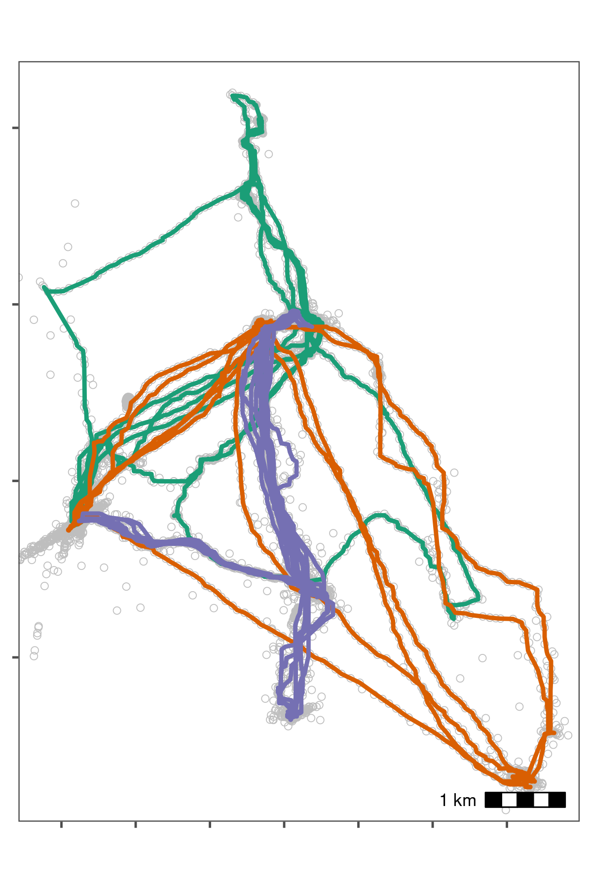

---
editor_options:
  chunk_output_type: console
output:
  pdf_document: default
  html_document: default
  bibliography: references.bib
---

# Processing Egyptian Fruit Bat Tracks

We show the pre-processing pipeline at work on the tracks of three Egyptian fruit bats (*Rousettus aegyptiacus*), and construct residence patches.

## Prepare libraries

Install the required `R` libraries that are required from CRAN if not already installed.

```{r}
# libs for data
library(data.table)
library(RSQLite)
library(atlastools)

# libs for plotting
library(ggplot2)
library(patchwork)

# recursion analysis
library(recurse)

# prepare a palette
pal <- RColorBrewer::brewer.pal(4, "Set1")
```

```{r install_atlastools_2, eval=TRUE}
if (!require(remotes)) {
  install.packages("remotes", repos = "http://cran.us.r-project.org")
}

# installation using remotes
remotes::install_github("pratikunterwegs/atlastools")
```

## Read bat data

Read the bat data from an `SQLite` database local file and convert to a plain text csv file.
This data can be found in the "data" folder.

```{r read_bat_data}
# prepare the connection
con <- dbConnect(
  drv = SQLite(),
  dbname = "data/Three_example_bats.sql"
)

# list the tables
table_name <- dbListTables(con)

# prepare to query all tables
query <- sprintf('select * from \"%s\"', table_name)

# query the database
data <- dbGetQuery(conn = con, statement = query)

# disconnect from database
dbDisconnect(con)
```

Convert data to csv, and save a local copy in the folder "data".

```{r}
# convert data to datatable
setDT(data)

# write data for QGIS
fwrite(data, file = "data/bat_data.csv")
```

## Exploratory Data Analysis Panels for Main Text Figure 1

Here, we make some basic figures for exploratory data analysis shown in Figure 1 of the main text.

Plot the bat data as a sanity check, and inspect it visually for errors.
The plot code is hidden in the rendered copy (PDF) of this supplementary material, but is available in the `Rmarkdown` file "supplement/06_bat_data.Rmd".

### Heatmap of Locations

Here we demonstrate a basic heatmap of locations, aggregating over all individuals.
In this one instance, the plotting code is also shown as a guide for readers, but in general, plotting code is hidden throughout this document.

```{r summarise_counts}
data_heatmap <- copy(data)
data_heatmap[, c("xround", "yround") := list(
  plyr::round_any(X, 250),
  plyr::round_any(Y, 250)
)]
data_heatmap <- data_heatmap[, .N, by = c("xround", "yround")]
```

```{r plot_heatmap}
fig_heatmap <-
  ggplot(data_heatmap) +
  geom_tile(
    aes(
      xround, yround,
      fill = N
    ),
    colour = "grey",
    size = 0.1,
    show.legend = F
  ) +
  scale_fill_viridis_c(
    option = "C",
    direction = 1,
    trans = "log10"
  ) +
  ggthemes::theme_few() +
  theme(
    axis.text = element_blank(),
    axis.title = element_blank()
  ) +
  coord_sf(crs = 2039)

ggsave(fig_heatmap,
  filename = "supplement/figures/fig_bat_heatmap_raw.png",
  dpi = 300,
  width = 6, height = 4
)
```

### Sampling Intervals

Here, we create the histogram of sampling intervals shown in Figure 1 of the main text.
The plotting code is hidden in the PDF version, but available in the source code.

```{r sampling_interval_check, echo=FALSE}
# get intervals per individual
data_for_intervals <- data[, list(lags = list(diff(TIME / 1000))), by = "TAG"]
data_for_intervals <- data_for_intervals[, list(lag = unlist(lags, recursive = F)), by = "TAG"]

# make figure
fig_lags <-
  ggplot(data_for_intervals) +
  geom_histogram(
    aes(
      x = lag / 8,
      fill = (lag / 8 > 3)
    ),
    position = position_identity(),
    bins = 15,
    # fill = "grey",
    col = "black",
    show.legend = F
  ) +
  geom_vline(
    xintercept = 1,
    col = "red"
  ) +
  scale_x_log10(
    labels = function(x) {
      sprintf("%ix", x)
    },
    breaks = c(1, 3, 10, 100, 1000)
  ) +
  scale_y_sqrt() +
  scale_fill_viridis_d(
    option = "H",
    begin = 0.1,
    end = 0.8
  ) +
  ggthemes::theme_few() +
  theme(
    axis.text.y = element_blank(),
    axis.text.x = element_text(
      face = "bold",
      size = 16
    ),
    axis.title.y = element_blank(),
    axis.title.x = element_text(
      face = "bold",
      size = 16
    )
  ) +
  labs(x = "Sampling interval")

# save to figures
ggsave(fig_lags,
  filename = "supplement/figures/fig_lag_histogram.png",
  dpi = 300,
  width = 3, height = 4
)
```

### Localisation Error Measured by Systems

Here, we create the histogram of location error (variance in X) [@weiser2016] shown in Figure 1 of the main text.
The plotting code is hidden in the PDF version, but available in the source code.

```{r localisation_error, echo=FALSE}
fig_error_histogram <-
  ggplot(data) +
  geom_histogram(
    aes(
      x = sqrt(VARX),
      fill = (sqrt(VARX) > 100)
    ),
    bins = 15,
    # fill = "grey",
    col = "black",
    show.legend = F
  ) +
  scale_fill_viridis_d(
    option = "H",
    begin = 0.1,
    end = 0.8
  ) +
  scale_x_log10(
    labels = function(x) {
      sprintf("%2.fm", x)
    }
  ) +
  scale_y_sqrt() +
  coord_cartesian(
    xlim = c(0.5, 5e3)
  ) +
  ggthemes::theme_few() +
  theme(
    axis.text.y = element_blank(),
    axis.text.x = element_text(
      face = "bold",
      size = 16
    ),
    axis.title.y = element_blank(),
    axis.title.x = element_text(
      face = "bold",
      size = 16
    )
  ) +
  labs(x = "Variance X")

# save to figures
ggsave(fig_error_histogram,
  filename = "supplement/figures/fig_error_histogram.png",
  dpi = 300,
  width = 3, height = 4
)
```

### Plot paths from raw tracking data

Here, we plot the paths of individual bats from the raw tracking data to visually inspect them for errors.

```{r echo=FALSE}
# plot bat data to examine for errors
fig_bat_raw <-
  ggplot(data) +
  geom_path(aes(X, Y,
    group = TAG,
    colour = TAG
  ),
  show.legend = FALSE
  ) +
  scale_colour_brewer(palette = "Dark2") +
  ggspatial::annotation_scale(location = "br") +
  ggthemes::theme_few() +
  theme(
    axis.text = element_blank(),
    axis.title = element_blank()
  ) +
  coord_sf(crs = 2039)
```

```{r plot_focus_bad_speed}
# this figure for the panel in main text figure 1
fig_bat_focus_bad_speed <-
  fig_bat_raw +
  coord_sf(
    crs = 2039,
    xlim = c(253000, NA),
    ylim = c(772000, NA)
  )

# save to supplement figures
ggsave(fig_bat_focus_bad_speed,
  filename = "supplement/figures/fig_bat_focus_bad_speed.png",
  dpi = 300,
  width = 4, height = 6
)
```

```{r echo=FALSE}
# save to figures
ggsave(fig_bat_raw,
  filename = "supplement/figures/fig_bat_raw.png",
  dpi = 300,
  width = 6, height = 4
)
```

![Movement data from three Egyptian fruit bats tracked using the ATLAS system (*Rousettus aegyptiacus*; [@toledo2020; @shohami2020]).
The bats were tracked in the Hula Valley, Israel (33.1$^{\circ}$N, 35.6$^{\circ}$E), and we use three nights of tracking (5\textsuperscript{th}, 6\textsuperscript{th}, and 7\textsuperscript{th} May, 2018), for our demonstration, with an average of 13,370 positions (SD = 2,173; range = 11,195 -- 15,542; interval = 8 seconds) per individual.
After first plotting the individual tracks, we notice severe distortions, making pre-processing necesary](figures/fig_bat_raw.png)

## Prepare data for filtering

Here we apply a series of simple filters.
It is always safer to deal with one individual at a time, so we split the data.table
into a list of data.tables to avoid mixups among individuals.

This is a very rudimentary demonstration of the principle behind **batch processing** --- splitting data into smaller, independent subsets, and applying the same steps to each subset.

### Prepare data per individual

```{r}
# split bat data by tag
# first make a copy using the data.table function copy
# this prevents the orignal data from being modified by atlastools
# functions which DO MODIFY BY REFERENCE!
data_split <- copy(data)

# now split
data_split <- split(data_split, by = "TAG")
```

## Filter by covariates

No natural bounds suggest themselves, so instead we proceed to filter by covariates, since point outliers are obviously visible.

We use filter out positions with `SD > 20` and positions calculated using only 3 base stations, using the function `atl_filter_covariates`.

First we calculate the variable `SD`.

```{r}
# get SD.
# since the data are data.tables, no assignment is necessary
invisible(
  lapply(data_split, function(dt) {
    dt[, SD := sqrt(VARX + VARY + (2 * COVXY))]
  })
)
```

Then we pass the filters to `atl_filter_covariates`.
We apply the filter to each individual's data using an `lapply`.

This is another basic example of the principles behind batch-processing, and could be parallelised using the `R` package `furrr` (see https://CRAN.R-project.org/package=furrr).

```{r}
# filter for SD <= 20
# here, reassignment is necessary as rows are being removed
# the atl_filter_covariates function could have been used here
data_split <- lapply(data_split, function(dt) {
  dt <- atl_filter_covariates(
    data = dt,
    filters = c(
      "SD <= 20",
      "NBS > 3"
    )
  )
})
```

### Sanity check: Plot filtered data

We plot the data to check whether the filtering has improved the data (Fig. 2.2).
The plot code is once again hidden in this rendering, but is available in the source code file.

```{r echo=FALSE}
# bind all individuals together
data_split <- rbindlist(data_split)
```

```{r echo=FALSE}
# now plot over raw data
fig_bat_filter_cov <-
  ggplot() +
  geom_point(
    data = data[!data_split,
      on = c("TAG", "X", "Y", "TIME")
    ],
    aes(X, Y),
    col = "grey",
    shape = 4
  ) +
  geom_path(
    data = data_split,
    aes(X, Y,
      col = TAG
    ),
    show.legend = FALSE
  ) +
  scale_colour_brewer(palette = "Dark2") +
  ggspatial::annotation_scale(location = "br") +
  ggthemes::theme_few() +
  theme(
    axis.text = element_blank(),
    axis.title = element_blank()
  ) +
  coord_sf(
    crs = 2039,
    xlim = range(data_split$X),
    ylim = range(data_split$Y)
  )
```

```{r echo=FALSE}
# save to figures
ggsave(fig_bat_filter_cov,
  filename = "supplement/figures/fig_bat_filter_cov.png",
  dpi = 300,
  width = 4, height = 6
)
```

![Bat data filtered for large location errors, removing observations with standard deviation $>$ 20. Grey crosses show data that were removed. Since the number of base stations used in the location process is a good indicator of error [@weiser2016], we also removed observations calculated using fewer than four base stations. Both steps used the function \texttt{atl\_filter\_covariates}.
This filtering reduced the data to an average of 10,447 positions per individual (78% of the raw data on average). However, some point outliers remain.](figures/fig_bat_filter_cov.png)

## Filter by speed

Some point outliers remain, and could be removed using a speed filter.

First we calculate speeds, using `atl_get_speed`. We must assign the speed output to a new column in the data.table, which has a special syntax which modifies in place, and is shown below. This syntax is a feature of the `data.table` package, not strictly of `atlastools` [@dowle2020].

```{r echo=FALSE}
# calculate speed on split data once more
data_split <- split(data_split, data_split$TAG)
```

```{r}
# get speeds as with SD, no reassignment required for columns
invisible(
  lapply(data_split, function(dt) {

    # first process time to seconds
    # assign to a new column
    dt[, time := floor(TIME / 1000)]

    dt[, `:=`(
      speed_in = atl_get_speed(dt,
        x = "X", y = "Y",
        time = "time",
        type = "in"
      ),
      speed_out = atl_get_speed(dt,
        x = "X", y = "Y",
        time = "time",
        type = "out"
      )
    )]
  })
)
```

Now filter for speeds > 20 m/s (around 70 km/h), passing the predicate (a statement return TRUE or FALSE) to `atl_filter_covariates`. First, we remove positions which have `NA` for their `speed_in` (the first position) and their `speed_out` (last position).

```{r}
# filter speeds
# reassignment is required here
data_split <- lapply(data_split, function(dt) {
  dt <- na.omit(dt, cols = c("speed_in", "speed_out"))

  dt <- atl_filter_covariates(
    data = dt,
    filters = c(
      "speed_in <= 20",
      "speed_out <= 20"
    )
  )
})
```

### Sanity check: Plot speed filtered data

The speed filtered data is now inspected for errors (Fig. 2.3). The plot code is once again hidden.

```{r echo=FALSE}
# bind all individuals together
data_split <- rbindlist(data_split)
```

```{r echo=FALSE}
# now plot over raw data
fig_bat_filter_speed <-
  ggplot() +
  geom_point(
    data = data[!data_split,
      on = c("TAG", "X", "Y", "TIME")
    ],
    aes(X, Y),
    col = "grey",
    shape = 4
  ) +
  geom_path(
    data = data_split,
    aes(X, Y, group = TAG, col = TAG),
    show.legend = F
  ) +
  scale_colour_brewer(palette = "Dark2") +
  ggspatial::annotation_scale(location = "br") +
  ggthemes::theme_few() +
  theme(
    axis.text = element_blank(),
    axis.title = element_blank()
  ) +
  coord_sf(
    crs = 2039,
    xlim = range(data_split$X),
    ylim = range(data_split$Y)
  )
```

```{r echo=FALSE}
# save to figures
ggsave(fig_bat_filter_speed,
  filename = "supplement/figures/fig_bat_filter_speed.png",
  dpi = 300,
  width = 4, height = 6
)
```


## Median smoothing

The quality of the data is relatively high, and a median smooth is not strictly necessary. We demonstrate the application of a 5 point median smooth to the data nonetheless (Fig. 2.4).

Since the median smoothing function `atl_median_smooth` modifies in place, we first make a copy of the data, using `data.table`'s `copy` function.
No reassignment is required, in this case. The `lapply` function allows arguments to `atl_median_smooth` to be passed within `lapply` itself.

In this case, the same moving window $K$ is applied to all individuals, but modifying this code to use the multivariate version `Map` allows different $K$ to be used for different individuals. This is a programming matter, and is not covered here further.

```{r}
# since the function modifies in place, we shall make a copy
data_smooth <- copy(data_split)

# split the data again
data_smooth <- split(data_smooth, by = "TAG")
```

```{r}
# apply the median smooth to each list element
# no reassignment is required as THE FUNCTION MODIFIES IN PLACE!
invisible(

  # the function arguments to atl_median_smooth
  # can be passed directly in lapply

  lapply(
    X = data_smooth,
    FUN = atl_median_smooth,
    time = "time", moving_window = 5
  )
)
```

### Sanity check: Plot smoothed data

```{r echo=FALSE}
# recombine split up data that has been smoothed
data_smooth <- rbindlist(data_smooth)
```

```{r echo=FALSE}
# plot the raw, filtered, and smoothed data
fig_bat_smooth <-
  ggplot() +
  geom_point(
    data = data,
    aes(X, Y),
    col = "grey",
    shape = 1,
    stroke = 0.3,
    show.legend = FALSE
  ) +
  geom_path(
    data = data_smooth,
    aes(X, Y,
      col = TAG
    ),
    lwd = 0.6,
    show.legend = FALSE
  ) +
  scale_colour_brewer(palette = "Dark2") +
  ggspatial::annotation_scale(location = "br") +
  ggthemes::theme_few() +
  theme(
    axis.text = element_blank(),
    axis.title = element_blank()
  ) +
  coord_sf(
    crs = 2039,
    xlim = range(data_smooth$X),
    ylim = range(data_smooth$Y)
  )
```

```{r echo=FALSE}
# save to figures
ggsave(fig_bat_smooth,
  filename = "supplement/figures/fig_bat_smooth.png",
  dpi = 300,
  width = 4, height = 6
)
```



## Making residence patches

### Calculating residence time

First, the data is put through the `recurse` package to get residence time [@bracis2018].

```{r}
# split the data
data_smooth <- split(data_smooth, data_smooth$TAG)
```

We calculated residence time, but since bats may revisit the same features, we want to prevent confusion between frequent revisits and prolonged residence.

For this, we stop summing residence times within $Z$ metres of a location if the animal exited the area for one hour or more. The value of $Z$ (radius, in `recurse` parameter terms) was chosen as 50m.


This step is relatively complicated and is only required for individuals which frequently return to the same location, or pass over the same areas repeatedly, and for which revisits (cumulative time spent) may be confused for residence time in a single visit.

While a simpler implementation using total residence time divided by the number of revisits is also possible, this does assume that each revisit had the same residence time.

```{r}
# get residence times
data_residence <- lapply(data_smooth, function(dt) {
  # do basic recurse
  dt_recurse <- getRecursions(
    x = dt[, c("X", "Y", "time", "TAG")],
    radius = 50,
    timeunits = "mins"
  )

  # get revisit stats
  dt_recurse <- setDT(
    dt_recurse[["revisitStats"]]
  )

  # count long absences from the area
  dt_recurse[, timeSinceLastVisit :=
    ifelse(is.na(timeSinceLastVisit), -Inf, timeSinceLastVisit)]
  dt_recurse[, longAbsenceCounter := cumsum(timeSinceLastVisit > 60),
    by = .(coordIdx)
  ]
  # get data before the first long absence of 60 mins
  dt_recurse <- dt_recurse[longAbsenceCounter < 1, ]

  dt_recurse <- dt_recurse[, list(
    resTime = sum(timeInside),
    fpt = first(timeInside),
    revisits = max(visitIdx)
  ),
  by = .(coordIdx, x, y)
  ]

  # prepare and merge existing data with recursion data
  dt[, coordIdx := seq(nrow(dt))]

  dt <- merge(dt,
    dt_recurse[, c("coordIdx", "resTime")],
    by = c("coordIdx")
  )

  setorderv(dt, "time")

  # print message when done
  message(sprintf("TAG %s residence times done", unique(dt$TAG)))

  dt
})
```

We bind the data together and assign a human readable timestamp column.

```{r}
# bind the list
data_residence <- rbindlist(data_residence)

# get time as human readable
data_residence[, ts := as.POSIXct(time, origin = "1970-01-01")]
```

### Constructing residence patches

Some preparation is required. First, the function requires columns `x`, `y`,
`time`, and `id`, which we assign using the `data.table` syntax. The `time` column is already present, but the other columns need to be renamed to lower case.
Then we subset the data to only work with positions where the individual had a residence time of more than 5 minutes.

```{r}
# add an id column
data_residence[, `:=`(
  id = TAG,
  x = X, y = Y
)]

# filter for residence time > 5 minutes
data_residence <- data_residence[resTime > 5, ]

# split the data
data_residence <- split(data_residence, data_residence$TAG)
```

We apply the residence patch method, using the default argument values (`lim_spat_indep = 100` (metres), `lim_time_indep = 30` (minutes)). We change the `buffer_radius` to 25 metres (twice the buffer radius is used, so points must be separated by 50m to be independent bouts), and `min_fixes = 3`.

```{r}
# segment into residence patches
data_patches <- lapply(data_residence, atl_res_patch,
  buffer_radius = 25,
  min_fixes = 3
)
```

### Getting residence patch data

We extract the residence patch data as spatial `sf-MULTIPOLYGON` objects.
These are returned as a list and must be converted into a single `sf` object.
These objects and the raw movement data are shown in Fig. 2.5.

```{r}
# get data spatials
data_spatials <- lapply(data_patches, atl_patch_summary,
  which_data = "spatial",
  buffer_radius = 25
)

# bind list
data_spatials <- rbindlist(data_spatials)

# convert to sf
library(sf)
data_spatials <- st_sf(data_spatials, sf_column_name = "polygons")

# assign a crs
st_crs(data_spatials) <- st_crs(2039)
```

### Write patch spatial representations

```{r}
st_write(data_spatials,
  dsn = "data/data_bat_residence_patches.gpkg",
  append = FALSE
)
```

Write cleaned bat data.

```{r}
fwrite(rbindlist(data_smooth),
  file = "data/data_bat_smooth.csv"
)
```

Write patch summary.

```{r}
# get summary
patch_summary <- lapply(data_patches, atl_patch_summary)

# bind summary
patch_summary <- rbindlist(patch_summary)

# write
fwrite(
  patch_summary,
  "data/data_bat_patch_summary.csv"
)
```

![A visual examination of plots of the bats' residence patches and linear approximations of paths between them showed that though all three bats roosted at the same site, they used distinct areas of the study site over the three nights **(a)**.
Bats tended to be resident near fruit trees, which are their main food source, travelling repeatedly between previously visited areas **(b, c)**.
However, bats also appeared to spend some time at locations where no fruit trees were recorded, prompting questions about their use of other food sources **(b, c)**.
When bats did occur close together, their residence patches barely overlapped, and their paths to and from the broad area of co-occurrence were not similar **(c)**.
Constructing residence patches for multiple individuals over multiple activity periods suggests interesting dynamics of within- and between-individual overlap **(b, c)**.](../figures/fig_07.png)
